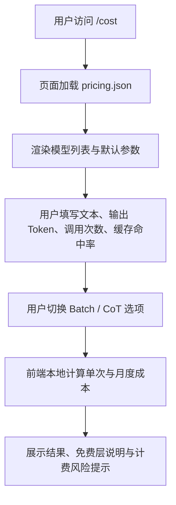

## 1. 产品概述
`c8.fit/cost` 是一个纯静态的 LLM Token 成本计算器，用于按模型定价、调用量、缓存命中率与推理开销估算单次、月度和年度费用。
- 目标用户是需要快速比较 DeepSeek、Groq、Cerebras、OpenAI、Gemini、硅基流动、Z.ai 等模型成本的开发者、独立开发者与原型团队。
- 产品价值是以零后端、零密钥、零上传的方式提供可公开部署的成本估算页面，并通过清晰提示帮助用户避开免费层与 API 转售相关的合规误区。

## 2. 核心功能

### 2.1 功能模块
1. **成本计算页**：模型选择、文本/Token 输入、输出 Token 估算、调用量与缓存命中率输入。
2. **计费结果展示**：单次、月度、年度成本计算结果展示，附带上下文窗口与免费层信息。
3. **风险提示区**：展示 CoT 隐藏 Token、Prompt Cache、Batch 折扣、中文字符估算偏差与 ToS 红线。
4. **静态定价数据**：通过同源 `pricing.json` 提供模型价格、上下文窗口、免费层标记与限额说明。
5. **Agent Skill 文档**：提供 `c8-cost` skill，供 Claude/Cursor 等工具在问及“算一个月多少钱”“哪家更便宜”等问题时复用。

### 2.2 页面详情
| 页面名称 | 模块名称 | 功能说明 |
|-----------|-------------|---------------------|
| 成本计算页 | 模型选择器 | 加载 `pricing.json` 中模型列表，显示 provider、model id、免费层标记 |
| 成本计算页 | 输入区 | 支持粘贴输入文本，按字符数估算 input token；支持手填输出 token、月调用次数与 cache 命中率 |
| 成本计算页 | 计费开关 | 提供 Batch API 折扣开关与 CoT 隐藏 token 估算开关 |
| 成本计算页 | 结果卡片 | 展示选定模型、ctx、单次成本、月度成本、年度成本 |
| 成本计算页 | 风险提示 | 根据模型与参数生成动态提示，说明 CoT、缓存、Batch 与中文估算偏差 |
| 成本计算页 | 合规说明 | 明示“不转售 API key，仅做成本估算”，免费层仅作参考且需以官网为准 |

## 3. 核心流程
用户打开 `https://c8.fit/cost` 后，页面自动加载静态定价文件并渲染模型列表。用户选择模型、粘贴 prompt、填写输出 token 与调用规模后，页面在本地即时计算成本，无需上传数据。若选择推理模型或启用 Batch/Cache 等条件，系统同步调整计算逻辑并更新风险提示。

## 4. 用户界面设计
### 4.1 设计风格
- 主色调：深色背景搭配蓝色强调色，突出“控制台/工具页”气质
- 按钮与输入框：圆角、低饱和边框、聚焦时清晰高亮
- 字体：优先使用系统无衬线字体，保证工具型页面可读性与兼容性
- 布局：桌面优先的单页卡片式布局，表单与结果分区清晰
- 图标/提示：以文本提示为主，不依赖额外图标资源

### 4.2 页面设计概览
| 页面名称 | 模块名称 | UI 元素 |
|-----------|-------------|-------------|
| 成本计算页 | 顶部标题区 | 产品标题、副标题、用途与隐私承诺 |
| 成本计算页 | 表单卡片 | 模型下拉框、文本域、数字输入框、复选开关 |
| 成本计算页 | 结果卡片 | 高对比度结果文字、重点金额高亮、上下文窗口附带展示 |
| 成本计算页 | 风险提示区 | 暖色背景、左侧强调边线、醒目的风险文案 |
| 成本计算页 | 页脚说明 | 定价更新时间、官网链接、合规提示 |

### 4.3 响应式
- 采用桌面优先设计，移动端自动收缩为单列布局
- 表单区在窄屏下纵向堆叠，保证输入与阅读顺序自然
- 所有关键操作元素保持较大点击区域，适配触屏使用
