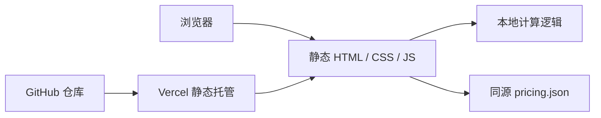

## 1. 架构设计
该项目采用纯静态前端架构，不引入后端服务、不存储用户数据、不代理任何第三方 API。页面通过相对路径加载本地 `pricing.json`，所有估算逻辑在浏览器端完成，最终由 Vercel 托管并通过自定义域 `c8.fit` 暴露 `/cost` 路径。



## 2. 技术说明
- 前端：原生 HTML5 + 内联 CSS + 原生 JavaScript
- 初始化方式：零构建静态目录结构
- 后端：无
- 数据存储：无数据库，使用静态 JSON 文件承载模型定价
- 部署：Vercel 静态托管 + 自定义域名 `c8.fit`
- 扩展内容：仓库内附带 `skills/c8-cost/SKILL.md` 作为 Agent Skill 说明文档

## 3. 路由定义
| 路由 | 用途 |
|-------|---------|
| /cost | 成本计算器主页面 |
| /cost/pricing.json | 模型定价静态数据 |
| / | 可选，按 `vercel.json` 决定是否回退到成本计算器首页 |

## 4. 数据定义
### 4.1 pricing.json 结构

```ts
type PricingModel = {
  id: string;
  provider: string;
  input: number;
  output: number;
  cached: number;
  ctx: string;
  free: boolean;
  limit?: string;
};

type PricingFile = {
  _note: string;
  updated: string;
  models: PricingModel[];
};
```

### 4.2 计算规则
- 输入 Token：默认按 `Math.round(字符数 / 4)` 估算，作为保守上界
- 缓存 Token：`cachedTok = round(inTok * cacheRate)`
- 未缓存输入成本：`uncachedTok * inputPrice / 1e6`
- 已缓存输入成本：`cachedTok * cachedPrice / 1e6`
- 输出成本：`outTok * outputPrice / 1e6`
- 总成本：`(输入成本 + 输出成本) * 调用次数`
- Batch：若启用，则单次输入与输出成本乘以 `0.5`
- CoT：对于推理类模型，若启用则对输出 token 乘以经验系数进行隐藏 thinking token 估算

## 5. 目录结构
| 路径 | 说明 |
|------|------|
| vercel.json | Vercel 路由与缓存头配置 |
| package.json | 最小项目元信息与本地静态预览脚本 |
| README.md | GitHub、Vercel、自定义域部署说明 |
| cost/index.html | 单文件静态页面，内联样式与脚本 |
| cost/pricing.json | 模型定价与免费层数据 |
| skills/c8-cost/SKILL.md | 面向 Agent 的成本估算 skill |

## 6. 部署与运维
- Vercel 识别为 Other/Static 项目，无需构建命令
- `pricing.json` 设置短缓存头，兼顾更新频率与访问性能
- 价格更新采用人工维护或后续 GitHub Actions 自动同步
- 页面不接入分析、埋点或远程接口，降低隐私与合规复杂度

## 7. 风险与约束
- 定价数据会过期，必须在页面和文档中明确“以官网为准”
- 免费层仅作能力提示，不能暗示可转售 key 或绕过官方 ToS
- 中文 token 估算存在偏保守误差，需要在 UI 中明确说明
- Batch 折扣与 Prompt Cache 并非全模型适用，需在结果提示中写明适用边界
